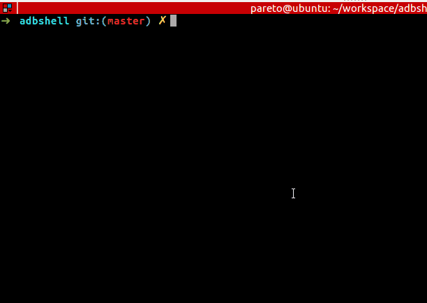

# readme

解决pull 代码以后 ,修改代码以后频繁去push 出错和修改路径





## remote 路径

脚本路径与pull 的同级 , 例如

```
adb pull /sdcard/mydump/lua
```

脚本就放在lua同级目录

```
$ ls
asd  lua/  push*  pwd/  readme.md
```

设置临时环境变量为pull路径

```
export RPATH=/sdcard/mydump/lua
```

## 输入文件名

输入修改的文件名

## 选择路径

输入路径序号

```
$ export RPATH=/sdcard/mydump/

$ ./push
input the file name a.lua
1 ./lua/a.lua 2 ./lua/unknown/a.lua
the correct path number 1
adb push ./lua/a.lua /sdcard/mydump//./lua/a.lua
./lua/a.lua: 1 file pushed. 0.0 MB/s (15 bytes in 0.012s)

```

windows 用git bash 运行

在adb push 前面加上

```
MSYS_NO_PATHCONV=1
```


